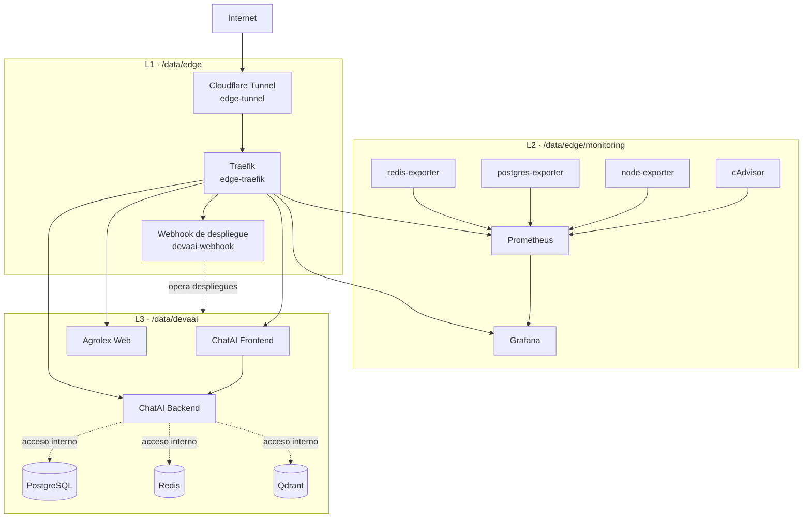

# Arquitectura actual de nodo-a

Este documento describe el runtime que se verificó en `nodo-a`: directorios de despliegue, proyectos Docker, redes y almacenamiento persistente. Es la referencia operativa actual; no incluye secretos, credenciales ni configuraciones históricas.

## Vista rápida



## Topología de directorios

| Nivel | Ruta | Responsabilidad | Manifiesto principal |
|---|---|---|---|
| L1 | `/data/edge` | Entrada, proxy inverso y automatización de despliegues | `docker-compose.yml` |
| L2 | `/data/edge/monitoring` | Observabilidad y métricas | `docker-compose.monitoring.yml` |
| L3 | `/data/devaai` | Aplicaciones y servicios de datos | `docker-compose.services.yml` y subproyectos |

## L1: Edge

`/data/edge/docker-compose.yml` define el proyecto `edge`:

| Contenedor | Función | Red |
|---|---|---|
| `edge-tunnel` | Túnel saliente de Cloudflare | `proxy-net` |
| `edge-traefik` | Proxy inverso y descubrimiento mediante etiquetas Docker | `proxy-net` |
| `devaai-webhook` | Handler de despliegue; tiene acceso controlado al socket Docker y a `/data/devaai` | `proxy-net` |

El flujo de entrada es: **Internet → Cloudflare Tunnel → Traefik → servicio etiquetado en `proxy-net`**.

### Rutas Traefik verificadas

| Host y ruta | Destino | Estado del destino |
|---|---|---|
| `chatai.elautomata.com` | `chatai-frontend:8081` | Activo |
| `chatai.elautomata.com/api` | `chatai-backend:8000` | Activo y healthy |
| `agrolex.marthaarce.com` | `agrolex-web:80` | Activo |
| `deploy.elautomata.com` | `devaai-webhook:9000` | Activo |
| `prometheus.elautomata.com` | `prometheus:9090` | Activo; protegido por autenticación en Traefik |
| `grafana.elautomata.com` | `grafana:3000` | Activo |
| `traefik.elautomata.com` | API interna de Traefik | Activo |
| `hermes.elautomata.com` | `hermes:8642` | Inactivo: el contenedor está detenido |

## L2: Monitoring

`/data/edge/monitoring/docker-compose.monitoring.yml` define el proyecto `monitoring`:

| Componente | Función |
|---|---|
| `cadvisor` | Métricas de contenedores Docker |
| `node-exporter` | Métricas del host |
| `postgres-exporter` | Métricas de PostgreSQL |
| `redis-exporter` | Métricas de Redis |
| `prometheus` | Recolección y almacenamiento de métricas |
| `grafana` | Visualización de dashboards |

Flujo de métricas: **exporters/cAdvisor → Prometheus → Grafana**.

## L3: DevaAI

| Proyecto | Ruta | Contenedores activos |
|---|---|---|
| Servicios de datos | `/data/devaai/docker-compose.services.yml` | `postgres-prod`, `redis-prod`, `qdrant-prod` |
| ChatAI | `/data/devaai/Chataiplatform/docker-compose.yml` | `chatai-backend`, `chatai-frontend` |
| Agrolex | `/data/devaai/agrolex/docker-compose.yml` | `agrolex-web` |

`chatai-backend` participa tanto en la red de entrada como en la red de servicios de datos. La conectividad entre estos componentes está disponible a nivel Docker; las dependencias de aplicación deben confirmarse desde su configuración específica antes de modificarla.

## Redes Docker

| Red | Propósito | Miembros relevantes |
|---|---|---|
| `proxy-net` | Entrada y exposición mediante Traefik | Edge, ChatAI frontend/backend, Agrolex, Prometheus y Grafana |
| `devaai_services-prod` | Comunicación interna de la aplicación y datos | ChatAI backend, PostgreSQL, Redis, Qdrant, Grafana y exporters de datos |
| `monitoring_monitoring` | Recolección de métricas | Prometheus, Grafana, cAdvisor y exporters |

Los puertos declarados dentro de los contenedores no implican publicación directa en el host. En la inspección del host, el único listener TCP expuesto directamente fue SSH; el acceso de aplicaciones se realiza a través del túnel y Traefik.

## Persistencia

| Servicio | Ubicación persistente |
|---|---|
| PostgreSQL | Volumen Docker `devaai_postgres_data` |
| Redis | Volumen Docker `devaai_redis_data` |
| Qdrant | Volumen Docker `devaai_qdrant_data` |
| ChatAI | Volúmenes Docker para Chroma, base de conocimiento y backups |
| Prometheus | Volumen Docker `monitoring_prometheus_data` |
| Grafana | Volumen Docker `monitoring_grafana_data` y configuración en `/data/edge/monitoring/grafana` |
| Agrolex | Bind mount `/data/devaai/agrolex/site` |

## Servicios compartidos disponibles

Estos componentes pueden ser consumidos por proyectos nuevos **solo** cuando el proyecto se conecta a la red correcta y recibe credenciales mediante un mecanismo seguro. No reutilices la base, usuario o secretos de otra aplicación.

### PostgreSQL

| Atributo | Estado verificado |
|---|---|
| Contenedor | `postgres-prod` |
| Versión | PostgreSQL 16.13 |
| Red | `devaai_services-prod` |
| Puerto | `5432/tcp` interno; sin publicación directa en el host |
| Persistencia | Volumen Docker en `/var/lib/postgresql/data` |
| Salud | `healthy` |

#### Bases de datos existentes

| Base de datos | Tamaño observado | Esquemas de aplicación |
|---|---:|---|
| `chatai` | 25 MB | `public` |
| `krill` | 7.5 MB | `public` |
| `postgres` | 7.5 MB | `public` |

El tamaño es una fotografía de la última inspección; comprobalo antes de planificar capacidad. `postgres` es la base administrativa. Las otras bases pertenecen a workloads existentes: no las uses como almacenamiento de un proyecto nuevo sin aprobación de su responsable.

#### Crear una base para otro proyecto

1. Conectá el nuevo servicio a `devaai_services-prod`.
2. Creá una **base y rol exclusivos** para el proyecto, con privilegios mínimos.
3. Guardá la contraseña únicamente en el gestor de secretos o `.env` protegido del proyecto.
4. Agregá el backup y la restauración de esa base al plan operativo.

Referencia de administración; reemplazá los marcadores en una sesión segura, nunca en este documento:

```sql
CREATE ROLE <app_role> LOGIN PASSWORD '<secret-from-secure-store>';
CREATE DATABASE <app_database> OWNER <app_role>;
```

El servicio debe conectarse con `postgres:5432`, su base exclusiva y el rol dedicado. No uses el superusuario ni otorgues permisos globales por conveniencia.

### Redis

| Atributo | Estado verificado |
|---|---|
| Contenedor | `redis-prod` |
| Imagen | `redis:7-alpine` |
| Red | `devaai_services-prod` |
| Puerto | `6379/tcp` interno; sin publicación directa en el host |
| Persistencia | Volumen Docker montado en `/data` |
| Autenticación | Requerida; un `PING` sin credenciales fue rechazado |
| Reinicio | `unless-stopped` |

Redis **puede ser usado por otro servicio**. El proyecto consumidor debe declararse en `devaai_services-prod` y recibir una URL o contraseña válida por un canal seguro. La dirección interna es `redis:6379`; el nombre de servicio es preferible al IP del contenedor.

```yaml
services:
  app:
    networks:
      - services-prod
    environment:
      REDIS_URL: redis://:<secret>@redis:6379/<logical-db>

networks:
  services-prod:
    external: true
    name: devaai_services-prod
```

No copies la credencial actual desde Docker, archivos de configuración o documentación. Para aislamiento fuerte entre proyectos, usá usuarios ACL dedicados o una instancia Redis separada; los índices lógicos de Redis no son un límite de autorización. La existencia del volumen confirma que los datos se conservan, pero el modo exacto de persistencia y la política de evicción deben validarse con el responsable de Redis antes de usarlo para datos críticos.

### Grafana

Grafana está activo en `grafana`, expuesto a través de Traefik y aprovisionado desde `/data/edge/monitoring/grafana`. Los siguientes dashboards están presentes como archivos de aprovisionamiento:

| Dashboard | UID | Observación |
|---|---|---|
| Docker Overview | `docker-overview` | Contenedores y recursos Docker |
| PostgreSQL Overview | `postgres-overview` | Métricas de PostgreSQL |
| Redis Overview | `redis-overview` | Métricas de Redis |
| System Overview | `system-overview` | Host mediante node-exporter |
| Traefik Overview | `traefik-overview` | Proxy y tráfico Traefik |
| Krill Apps Overview | `krill-apps-overview` | Requiere revisión: su stack ya no está desplegado |

Para agregar un dashboard, guardá su JSON en `/data/edge/monitoring/grafana/dashboards/`, asignale un `uid` estable y documentá el datasource y las métricas que consume. Verificá la importación y permisos desde Grafana; la existencia del archivo no sustituye una comprobación de acceso con la cuenta correspondiente.

### Prometheus y alertas

| Atributo | Estado verificado |
|---|---|
| Contenedor | `prometheus` |
| Configuración | `/data/edge/monitoring/prometheus/prometheus.yml` |
| Rule groups cargados | 0 |
| Alertas activas | 0 |
| Alertmanager configurados | Ninguno (`alertmanagers: []`) |
| Rule files configurados | Ninguno (`rule_files: []`) |

Actualmente Prometheus recolecta métricas, pero **no hay alertas configuradas ni un destino de notificaciones**. Por eso una caída puede aparecer en un dashboard sin generar aviso automático.

Para habilitar alertas de un servicio nuevo:

1. Confirmá que Prometheus puede alcanzar su endpoint `/metrics` desde `monitoring_monitoring`.
2. Creá un directorio de reglas, por ejemplo `/data/edge/monitoring/prometheus/rules/`.
3. Montá ese directorio en el contenedor Prometheus y agregalo a `rule_files` en `prometheus.yml`.
4. Validá las reglas con `promtool` antes de recargar el stack.
5. Incorporá Alertmanager y un receptor aprobado (correo, webhook o chat) antes de asumir que habrá notificaciones.

Ejemplo mínimo de regla de disponibilidad:

```yaml
groups:
  - name: <service>-availability
    rules:
      - alert: <Service>Down
        expr: up{job="<service>"} == 0
        for: 5m
        labels:
          severity: critical
        annotations:
          summary: "<service> no responde a Prometheus"
```

No actives reglas de alerta sin dueño, severidad, canal de recepción y procedimiento de respuesta. También revisá los targets obsoletos presentes hoy en `prometheus.yml`; generan señales no fiables para dashboards y alertas.

## Estado observado

- 15 de 16 contenedores estaban en ejecución.
- `chatai-backend`, `cadvisor`, `postgres-prod` y `redis-prod` reportaban estado `healthy`.
- No se observaron reinicios ni eventos OOM.
- `hermes` estaba detenido con salida `0`; no pertenece a los proyectos Compose documentados arriba y requiere confirmación funcional si se espera que permanezca activo.
- El renderizado de la configuración de monitoring emitió una advertencia por la variable de entorno `J` no definida. No afectó al runtime observado, pero debe corregirse antes de un redeploy.

## Verificación operativa

```bash
# Estado de los proyectos Compose
cd /data/edge && docker compose ps
cd /data/edge/monitoring && docker compose -f docker-compose.monitoring.yml ps
cd /data/devaai && docker compose -f docker-compose.services.yml ps
cd /data/devaai/Chataiplatform && docker compose ps
cd /data/devaai/agrolex && docker compose ps

# Estado y consumo de contenedores
docker ps -a
docker stats --no-stream

# Redes y conectividad declarada
docker network ls
docker inspect <container>
```

## Límites de este documento

- No documenta valores de archivos `.env`, tokens ni credenciales.
- No afirma dependencias HTTP o de base de datos que no hayan sido verificadas desde la configuración de cada aplicación.
- No reemplaza procedimientos de backup, recuperación ni seguridad.

**Última verificación:** 2026-08-19
**Fuente de verdad:** runtime Docker y manifiestos Compose presentes en `nodo-a`.

---

## Guía para ampliar la infraestructura

Usá esta guía para incorporar un contenedor sin romper rutas, datos o monitoreo existentes. El principio es simple: **cada servicio recibe únicamente las redes, volúmenes y privilegios que necesita**.

### Camino rápido

1. Clasificá el servicio: público, interno, de datos o de observabilidad.
2. Elegí el manifiesto y las redes según la tabla siguiente.
3. Validá la configuración, desplegá solo el servicio afectado y verificá salud, logs y métricas.

### Dónde incorporar cada servicio

| Tipo de servicio | Ubicación recomendada | Redes | Exposición |
|---|---|---|---|
| Aplicación web/API nueva | `/data/devaai/<nombre>/docker-compose.yml` | `proxy-net`; agregar `devaai_services-prod` solo si consume datos compartidos | Etiquetas Traefik si debe ser pública |
| Worker, cron o integración interna | `/data/devaai/<nombre>/docker-compose.yml` | `devaai_services-prod` solo si requiere PostgreSQL, Redis o Qdrant | Sin etiquetas Traefik ni puertos de host |
| Servicio de datos compartido | `/data/devaai/docker-compose.services.yml` | `services-prod` | Solo red interna; volumen persistente y plan de backup obligatorios |
| Exporter o componente de observabilidad | `/data/edge/monitoring/docker-compose.monitoring.yml` | `monitoring`; agregar una red de servicio solo si debe consultar ese servicio | No exponerlo por Traefik salvo necesidad operativa explícita |
| Cambio de entrada, proxy o despliegue | `/data/edge/docker-compose.yml` | `proxy-net` | Revisar seguridad y rutas antes de aplicar |

> No agregues un servicio de aplicación al compose de servicios de datos solo por comodidad. Separar aplicaciones, infraestructura y observabilidad limita el impacto de cada despliegue.

### Redes disponibles y reglas de uso

| Red | Cuándo usarla | No usarla para |
|---|---|---|
| `proxy-net` | Servicios que Traefik debe poder alcanzar | Bases de datos, workers o exporters sin ruta pública |
| `devaai_services-prod` | Comunicación interna con PostgreSQL, Redis, Qdrant y servicios de aplicación | Acceso público o métricas genéricas |
| `monitoring_monitoring` | Prometheus y sus targets de métricas | Tráfico de aplicación o datos de negocio |

Para conectar un proyecto nuevo a una red ya existente, declarala como externa con su nombre real:

```yaml
networks:
  proxy-net:
    external: true
    name: proxy-net
  services-prod:
    external: true
    name: devaai_services-prod
  monitoring:
    external: true
    name: monitoring_monitoring
```

Declarar una red no implica usarla: asignala al servicio solo cuando sea necesaria. Por ejemplo, una API pública que usa Redis necesita `proxy-net` y `services-prod`; un worker que consume Redis necesita solo `services-prod`.

### Plantilla: aplicación web pública

Crear el proyecto en `/data/devaai/<nombre>/docker-compose.yml`. Esta plantilla no publica puertos en el host; Traefik llega al contenedor a través de `proxy-net`.

```yaml
services:
  app:
    image: registry.example.com/organization/app:<immutable-tag>
    container_name: <nombre>-app
    restart: unless-stopped
    networks:
      - proxy-net
      # - services-prod # solo si consume infraestructura compartida
    labels:
      - traefik.enable=true
      - traefik.docker.network=proxy-net
      - traefik.http.routers.<nombre>.rule=Host(`<host>`)
      - traefik.http.routers.<nombre>.entrypoints=web
      - traefik.http.services.<nombre>.loadbalancer.server.port=<puerto-interno>
    healthcheck:
      test: ["CMD", "wget", "-qO-", "http://localhost:<puerto-interno>/health"]
      interval: 30s
      timeout: 10s
      retries: 3
      start_period: 20s

networks:
  proxy-net:
    external: true
    name: proxy-net
  services-prod:
    external: true
    name: devaai_services-prod
```

Antes de activar la ruta, confirmá que el endpoint de salud existe dentro de la imagen. Si no existe, definí un health check que represente disponibilidad real; no uses un comando que siempre termine exitosamente.

### Plantilla: servicio interno o worker

```yaml
services:
  worker:
    image: registry.example.com/organization/worker:<immutable-tag>
    container_name: <nombre>-worker
    restart: unless-stopped
    networks:
      - services-prod
    healthcheck:
      test: ["CMD", "<comando-de-salud>"]
      interval: 30s
      timeout: 10s
      retries: 3

networks:
  services-prod:
    external: true
    name: devaai_services-prod
```

Un worker no necesita `ports:` ni etiquetas `traefik.*`. Si requiere secretos, cargalos desde un archivo `.env` local con permisos restringidos y nunca los agregues a este documento ni al repositorio.

### Plantilla: servicio con datos persistentes

Todo servicio que almacene datos debe usar un volumen nombrado, declarar cómo se realiza su backup y definir el procedimiento de restauración antes del despliegue.

```yaml
services:
  datastore:
    image: vendor/datastore:<immutable-tag>
    container_name: <nombre>-datastore
    restart: unless-stopped
    networks:
      - services-prod
    volumes:
      - <nombre>_data:/var/lib/<nombre>
    healthcheck:
      test: ["CMD", "<comando-de-salud>"]
      interval: 30s
      timeout: 10s
      retries: 3

networks:
  services-prod:
    external: true
    name: devaai_services-prod

volumes:
  <nombre>_data:
```

No uses `docker compose down -v` ni `docker volume prune` sobre un stack con datos sin una copia verificada. Los volúmenes actuales de PostgreSQL, Redis, Qdrant, ChatAI, Prometheus y Grafana son datos operativos.

### Rutas y Traefik

Para publicar una aplicación se requieren cuatro condiciones:

1. El contenedor está conectado a `proxy-net`.
2. Tiene `traefik.enable=true`.
3. Declara un router con host, entrypoint y puerto interno correctos.
4. El host está definido en Cloudflare Tunnel para llegar a Traefik.

`proxy-net` por sí sola no publica un servicio. Evitá agregar `ports:` para resolver un problema de routing: primero verificá las etiquetas del router, el puerto interno, la conectividad de la red y la configuración del túnel.

Después del despliegue, comprobá la ruta desde Traefik:

```bash
docker exec edge-traefik wget -qO- http://localhost:8080/api/http/routers
```

### Observabilidad

Al agregar una aplicación con endpoint Prometheus, conectala a `monitoring_monitoring` y agregá un job a `/data/edge/monitoring/prometheus/prometheus.yml`:

```yaml
- job_name: '<nombre>'
  static_configs:
    - targets: ['<nombre>-app:<puerto-metrics>']
      labels:
        instance: '<nombre>'
  metrics_path: /metrics
```

Luego validá y recargá únicamente el stack de monitoring. No expongas `/metrics` públicamente para que Prometheus pueda recolectarlas.

**Estado conocido:** la configuración actual de Prometheus aún contiene targets de servicios que ya no están desplegados. Revisá y eliminá esos targets obsoletos antes de tomar alertas o disponibilidad como fuente confiable.

### Checklist previo al despliegue

- [ ] La imagen usa un tag inmutable o digest, no solo `latest`.
- [ ] El servicio está en el directorio y compose correctos.
- [ ] Recibe únicamente las redes necesarias.
- [ ] No publica puertos de host si Traefik puede enrutarlo.
- [ ] Tiene `restart: unless-stopped` y un health check significativo.
- [ ] Tiene límites de recursos acordes a la capacidad disponible del host.
- [ ] Los secretos permanecen fuera del compose versionado y de la documentación.
- [ ] Los datos persistentes usan volumen y cuentan con backup/restauración verificados.
- [ ] La instrumentación o exporter se agregó a Prometheus cuando corresponde.
- [ ] Se registró la ruta, propósito y responsable en este documento.

### Despliegue seguro y verificación

Ejecutá los comandos desde el directorio del proyecto que modificaste. No ejecutes `down` para actualizar un único servicio.

```bash
# 1. Validar sintaxis y resolución de Compose
docker compose config -q

# 2. Obtener la imagen declarada
docker compose pull <servicio>

# 3. Crear o actualizar solo el servicio afectado
docker compose up -d --no-deps <servicio>

# 4. Verificar runtime
docker compose ps <servicio>
docker inspect <contenedor> --format '{{.State.Status}} health={{if .State.Health}}{{.State.Health.Status}}{{else}}n/a{{end}}'
docker logs --since 10m <contenedor>
```

Para un servicio público, verificá además que Traefik lo descubrió y que la ruta responde a través del dominio esperado. Para un servicio de datos, verificá la operación de backup antes de declararlo productivo. Para un target de métricas, revisá su estado en Prometheus después de recargar la configuración.

### Rollback

1. Conservá el tag o digest anterior antes de modificar el compose o `.env`.
2. Restaurá esa referencia en el manifiesto.
3. Ejecutá `docker compose up -d --no-deps <servicio>`.
4. Confirmá salud, logs, ruta y métricas.

El rollback de un servicio con migraciones o cambios de esquema requiere un plan de datos específico; volver la imagen no revierte automáticamente la base de datos.

### Límites de seguridad

- No montar `/var/run/docker.sock` en un contenedor nuevo. Los componentes existentes que lo usan son excepciones operativas de alto privilegio.
- Preferir bind mounts de solo lectura cuando un servicio solo consume archivos.
- No usar `privileged: true` ni capacidades adicionales sin una necesidad documentada.
- No incluir contraseñas, tokens, hashes de autenticación ni valores de `.env` en documentación, logs o commits.
- No ejecutar limpieza global de Docker durante un incidente. Revisar primero imágenes, volúmenes y dependencias con `docker system df` y `docker ps -a`.

### Actualización de este mapa

Cada alta o baja de contenedor debe actualizar como mínimo:

1. La tabla del nivel correspondiente.
2. La red y el volumen que utiliza.
3. La ruta Traefik, si es pública.
4. El job de Prometheus, si expone métricas.
5. El estado de backup y rollback, si conserva datos.
