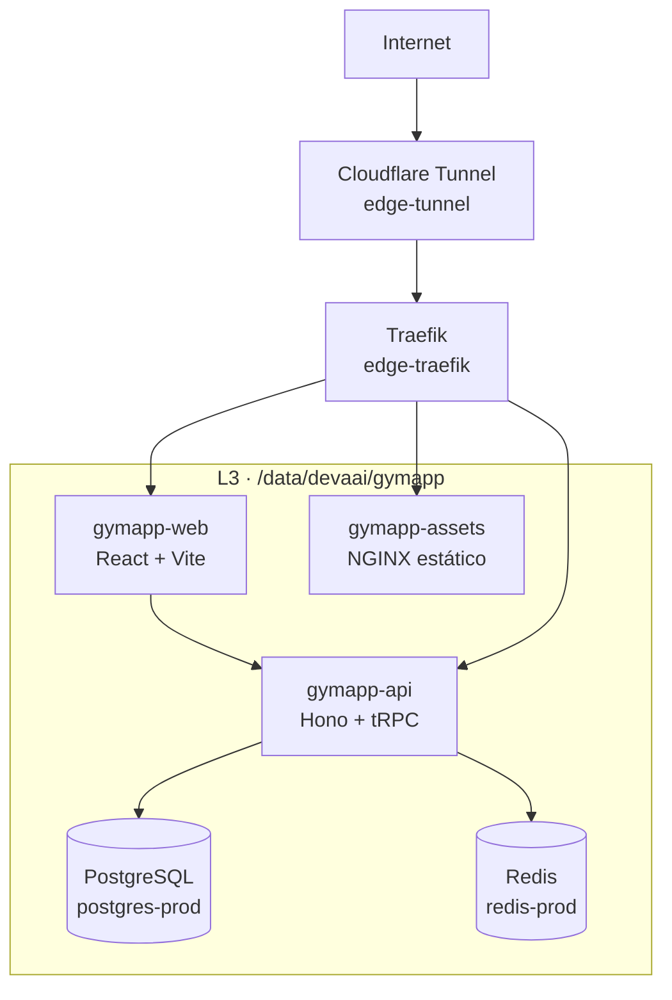

# Plan de desarrollo — GymApp / Recomp Tracker v2

**App de registro de actividades para rutina de Recomposición Corporal**

- **Fecha:** 2026-08-20
- **Estado:** Planificación v2 · basado en arquitectura real de `nodo-a`
- **Plataformas objetivo:** Web móvil → APK Android → Zepp OS (smartwatch Amazfit Bip Max)
- **Infraestructura destino:** `nodo-a` (/data/devaai) con PostgreSQL, Redis, Traefik y Prometheus compartidos

---

## 1. Visión y objetivo

Crear una aplicación para planificar y registrar entrenamientos de recomposición corporal, con catálogo de ejercicios ilustrado, registro de series/repeticiones/peso, seguimiento de métricas corporales y visualización de progreso.

**Objetivos del producto:**

1. Consultar un catálogo de 1.324 ejercicios con animaciones e instrucciones en español.
2. Armar rutinas personalizadas (días, ejercicios, series objetivo, descansos).
3. Registrar cada entrenamiento: series, repeticiones, peso, RPE y descansos.
4. Registrar métricas corporales (peso, % grasa, cintura) para seguir la recomposición.
5. Ver historial y progreso por ejercicio y métrica.
6. Sincronizar los mismos datos en web, APK Android y reloj.

---

## 2. Fuente de datos: dataset de ejercicios

**Repositorio:** `hasaneyldrm/exercises-dataset` (GitHub)

| Característica | Detalle |
| --- | --- |
| Ejercicios | 1.324 |
| Datos por ejercicio | categoría, parte del cuerpo, equipamiento, músculo objetivo, músculos secundarios |
| Instrucciones | Paso a paso en 10 idiomas, incluido español |
| Multimedia | GIF animado + miniatura 180×180 por ejercicio |
| Formato | JSON único (`exercises.json`, ~17 MB) con esquema documentado |
| Cobertura útil | ~325 ejercicios con peso corporal (~25 %, aptos para casa) |

### Licencia

- **Código, estructura de datos y textos de instrucciones:** MIT → uso libre.
- **Imágenes y GIFs:** © Gym visual (<https://gymvisual.com/>), redistribuidos con permiso.
  - **Obligación:** mantener la atribución `© Gym visual — https://gymvisual.com/` visible donde se muestre la multimedia.
  - **Restricción comercial:** si se publica comercialmente, se debe obtener licencia propia o reemplazar la multimedia.

---

## 3. Stack técnico ajustado a `nodo-a`

El plan original proponía MySQL, pero `nodo-a` ya opera **PostgreSQL 16.13** y **Redis 7** como servicios compartidos. Se mantiene TypeScript full-stack por productividad y coherencia entre frontend, backend y ORM.

| Capa | Tecnología | Justificación |
| --- | --- | --- |
| Monorepo | pnpm workspaces | Un solo repo, dependencias compartidas, build coordinado |
| Frontend web | React 19 + TypeScript + Vite + Tailwind CSS + shadcn/ui | Mobile-first, bundle liviano, buen DX |
| Backend | Hono + tRPC 11 (type-safe end-to-end) | Liviano, rápido, tipado completo front-back |
| Base de datos | PostgreSQL 16 + Drizzle ORM | Reutiliza el servicio existente en `nodo-a`; migrations y queries type-safe |
| Caché / colas | Redis 7 | Caché de catálogo, sesiones, cola de sincronización offline |
| Autenticación futura | Kimi OAuth (plataforma existente) | Solo si el MVP deja de ser monousuario |
| Contenerización | Docker + Docker Compose | Despliegue reproducible en `/data/devaai/gymapp` |
| Proxy / HTTPS | Traefik (existente en `edge`) | Descubrimiento automático por etiquetas Docker |
| Observabilidad | Prometheus + Grafana (existentes) | Métricas de salud y uso |
| APK Android | Capacitor (sobre la web app) | Sin reescritura del frontend |
| Reloj | Zepp OS Mini Program | JavaScript, framework oficial Zepp OS |

---

## 4. Arquitectura de despliegue en `nodo-a`



### Servicios Docker

| Servicio | Contenedor | Redes | Exposición |
| --- | --- | --- | --- |
| `gymapp-web` | React + Vite SSR/static | `proxy-net` | `gymapp.elautomata.com` vía Traefik |
| `gymapp-api` | Hono + tRPC | `proxy-net`, `devaai_services-prod` | `api-gymapp.elautomata.com` vía Traefik |
| `gymapp-assets` | NGINX sirviendo GIFs/imágenes | `proxy-net` | `assets-gymapp.elautomata.com` vía Traefik |

### Dominios propuestos

| Servicio | Host sugerido |
| --- | --- |
| Web app | `gymapp.elautomata.com` |
| API | `api-gymapp.elautomata.com` |
| Assets estáticos | `assets-gymapp.elautomata.com` |

Nombre corto, descriptivo y fácil de recordar. Alternativas: `recomp.elautomata.com` o `entrena.elautomata.com`.

---

## 5. Estructura del repositorio

```text
gymapp/
├── apps/
│   ├── web/                  # React + Vite + Tailwind + shadcn
│   │   ├── src/
│   │   ├── public/
│   │   ├── Dockerfile
│   │   └── package.json
│   └── api/                  # Hono + tRPC + Drizzle
│       ├── src/
│       ├── migrations/
│       ├── Dockerfile
│       └── package.json
├── packages/
│   ├── db/                   # Esquema Drizzle + migraciones + seed
│   │   ├── schema.ts
│   │   ├── seed.ts
│   │   └── package.json
│   └── shared/               # Tipos y utilidades compartidas
├── assets/
│   └── exercises/              # GIFs e imágenes del dataset (no versionado)
├── docker-compose.yml
├── docker-compose.prod.yml
├── .env.example
└── README.md
```

---

## 6. Modelo de datos (PostgreSQL + Drizzle)

El esquema original se mantiene, adaptado a PostgreSQL. Se agrega `workout_queue` para offline y `sync_state` para el reloj.

| Tabla | Propósito | Campos clave |
| --- | --- | --- |
| `exercises` | Catálogo importado del dataset | slug, nombre, categoría, equipamiento, target, músculos, instrucciones ES/EN, imagen_url, gif_url, atribución |
| `routines` | Rutinas del usuario | nombre, descripción, activa |
| `routine_exercises` | Ejercicios de cada rutina | orden, series objetivo, reps objetivo, descanso (s), notas |
| `workout_sessions` | Sesiones de entrenamiento | rutina, fecha, inicio/fin, notas |
| `set_logs` | Series registradas | sesión, ejercicio, nº de serie, reps, peso (kg), RPE |
| `body_metrics` | Métricas de recomposición | fecha, peso (kg), % grasa, cintura (cm), notas |
| `workout_queue` | Cambios pendientes de sincronización offline | tipo, payload, timestamp, intentos, error |
| `sync_state` | Cursor de sincronización por dispositivo | device_id, last_sync_at |
| `gym_locations` | Gimnasios configurados por el usuario | nombre, notas, activo |
| `gym_equipment` | Máquinas disponibles en un gimnasio | gym_id, brand_model, equipment_type, body_part, target, notas |
| `equipment_exercise_match` | Relación máquina ↔ ejercicios del dataset | gym_equipment_id, exercise_id, ajustable, prioridad |

### Decisiones de datos

- El seed carga **solo metadatos** en PostgreSQL. Los archivos multimedia se sirven desde `gymapp-assets`, no desde la base.
- Se usa `slug` o `id` numérico estable del dataset como clave externa de ejercicios.
- Se mantiene el MVP **monousuario**: sin tabla `users` inicial.

---

## 6.5 Catálogo de gimnasios y equipamiento

Se incorpora de a poco la maquinaria disponible en cada gimnasio para filtrar los ejercicios que realmente se pueden hacer.

### Cómo funciona el match

El dataset no incluye modelos de máquinas, solo el campo genérico `equipment` (machine, barbell, dumbbell, etc.). Por eso el mapeo se hace por **tipo de equipo + grupo muscular + patrón de movimiento**, no por modelo exacto.

Ejemplo:

| Máquina Bodytone | Equipment | Body part | Target | Ejercicios posibles |
| --- | --- | --- | --- | --- |
| Forza Bold Leg Extension | machine | upper legs | quads | leg extension machine |
| Forza Bold Seated Leg Curl | machine | upper legs | hamstrings | seated leg curl |
| Forza Bold Biceps | machine | upper arms | biceps | biceps curl machine |
| SRX81 Power Rack | barbell | multiple | multiple | squat, bench press, overhead press |
| SRX16 Lat Pulldown | machine | back | lats | lat pulldown |

### Carga de datos

- Bodytone no expone una API pública documentada.
- Se carga manualmente o mediante un scraper controlado.
- Se puede importar desde un CSV/JSON con la lista de máquinas del gimnasio.

### UX

- El usuario selecciona el gimnasio activo.
- En el catálogo aparece un filtro: **"Solo ejercicios disponibles en este gimnasio"**.
- Al armar rutinas, se sugiere ejercicios que usan máquinas disponibles.

---

## 7. Roadmap por fases

### Fase 0 — Fundamentos y setup ✅ / En construcción

- [x] Validar dataset y licencia
- [x] Definir arquitectura real contra `nodo-a`
- [ ] Inicializar monorepo con pnpm workspaces
- [ ] Dockerizar web, api y assets
- [ ] Crear base `gymapp` y rol exclusivo en PostgreSQL
- [ ] Definir esquema Drizzle y primera migración
- [ ] Resolver conexión API ↔ PostgreSQL en red `devaai_services-prod`

### Fase 1 — Web app móvil (MVP)

- [ ] Seed de los 1.324 ejercicios (metadatos + URLs de assets)
- [ ] Servir assets estáticos desde `gymapp-assets`
- [ ] Catálogo: búsqueda en vivo, filtros por grupo muscular y equipamiento, ficha con GIF e instrucciones en español
- [ ] Rutinas: crear/editar, agregar ejercicios con series/reps/descanso objetivo
- [ ] Entrenar: iniciar sesión desde rutina, registrar series (peso × reps × RPE), temporizador de descanso
- [ ] Historial: sesiones pasadas con detalle
- [ ] Progreso: evolución de peso por ejercicio + métricas corporales con gráficos
- [ ] Diseño mobile-first, modo oscuro, uso con una mano
- [ ] Atribución © Gym visual en fichas de ejercicio
- [ ] Caché offline mínima del catálogo y rutina del día (service worker)
- [ ] Endpoint `/health` y `/metrics` básico
- [ ] Backup automático de la base con `pg_dump`

**Criterio de cierre:** registrar un entrenamiento completo desde el celular y ver el progreso al día siguiente.

### Fase 1.5 — Equipamiento de gimnasio

- [ ] Modelo `gym_locations`, `gym_equipment`, `equipment_exercise_match`.
- [ ] UI para crear/editar gimnasios y cargar su lista de máquinas.
- [ ] Importación manual o por CSV/JSON de máquinas.
- [ ] Filtro "Disponible en mi gimnasio" en catálogo y al armar rutinas.
- [ ] Mapeo inicial de la línea Bodytone del primer gimnasio.

**Criterio de cierre:** armar una rutina usando solo ejercicios que se pueden hacer con las máquinas disponibles.

### Fase 2 — APK Android

- [ ] Integrar Capacitor sobre la web app
- [ ] Configurar icono, splash screen y nombre de app
- [ ] Soporte offline: rutina del día en caché, cola local de series, sincronización diferida
- [ ] Notificaciones locales (recordatorio de entrenamiento)
- [ ] Generar APK firmado para instalación directa
- [ ] (Opcional) Publicación en Google Play

**Criterio de cierre:** APK instalable que registra entrenamientos igual que la web.

### Fase 3 — Zepp OS (Bip Max + app Zepp)

- [ ] Mini Program en JavaScript con framework oficial Zepp OS
- [ ] Ver rutina del día y ejercicio actual
- [ ] Marcar series completadas (reps/peso rápido con +/-)
- [ ] Temporizador de descanso con vibración
- [ ] Sincronización: Mini Program → side-service en app Zepp → API central
- [ ] (Explorar) Reconocimiento automático de 25 movimientos de fuerza del Bip Max

**Criterio de cierre:** completar una sesión desde el reloj y verla reflejada en la app.

---

## 8. Seguridad, backup y operación

### Base de datos PostgreSQL

- Crear rol y base exclusivos para `gymapp`.
- No usar el superusuario ni compartir credenciales con otros proyectos.
- Variables de entorno en `.env` con permisos restringidos (`chmod 600`).

### Backup

- `pg_dump` diario automatizado (cron o contenedor `gymapp-backup`).
- Retención mínima: 7 días locales + copia externa periódica.
- Probar restauración antes de declarar productivo.

### Secretos

- Nunca commitear `.env`, tokens ni credenciales.
- Secretos inyectados por variables de entorno en runtime.

### Despliegue

```bash
cd /data/devaai/gymapp
docker compose -f docker-compose.prod.yml config -q
docker compose -f docker-compose.prod.yml pull
docker compose -f docker-compose.prod.yml up -d
docker compose -f docker-compose.prod.yml ps
```

### Observabilidad

- Endpoint `/health` para healthcheck de Docker.
- Endpoint `/metrics` con contador básico de requests/errores.
- Job de Prometheus agregado en `/data/edge/monitoring/prometheus/prometheus.yml`:

```yaml
- job_name: 'gymapp'
  static_configs:
    - targets: ['gymapp-api:3000']
      labels:
        instance: 'gymapp-api'
  metrics_path: /metrics
```

- Dashboard de Grafana para disponibilidad y uso.

---

## 9. Riesgos y mitigaciones

| Riesgo | Impacto | Mitigación |
| --- | --- | --- |
| Licencia multimedia © Gym visual | Bloqueo comercial | Atribución visible; reemplazar assets si se comercializa |
| Peso de 1.324 GIFs e imágenes | App lenta / bundle pesado | Servir assets bajo demanda desde `gymapp-assets`; lazy loading; caché en dispositivo |
| Pantalla pequeña del reloj | Flujo completo no cabe | Reloj solo marca series y descansos; edición queda en móvil |
| Ecosistema Zepp | Requiere cuenta de desarrollador | Crear cuenta Zepp Developer al iniciar Fase 3 |
| Offline en el gimnasio | Pérdida de datos | Cola local + sincronización diferida; Redis para estados de sync |
| Timeout de conexión a BD | Bloquea MVP | Validar red `devaai_services-prod`, credenciales y healthcheck antes de features |
| Falta de backup | Pérdida de historial | `pg_dump` automatizado y restauración verificada |

---

## 10. Decisiones pendientes

1. **Login / multiusuario:** el MVP es monousuario. Si varias personas la usarán, agregar Kimi OAuth antes del APK.
2. **Idioma de nombres de ejercicios:** el dataset trae nombres en inglés (instrucciones sí en español). Mantener nombres originales en MVP; traducir es trabajo aparte.
3. **Publicación:** web autohospedada en `gymapp.elautomata.com`; APK por descarga directa; Google Play opcional.
4. **Chain de CI/CD:** definir si el deploy se hará manual en `nodo-a` o mediante webhook `devaai-webhook`.

---

## 11. Referencias

- Dataset: <https://github.com/hasaneyldrm/exercises-dataset>
- Licencia multimedia: <https://gymvisual.com/> (© Gym visual)
- Drizzle ORM: <https://orm.drizzle.team/>
- Hono: <https://hono.dev/>
- tRPC: <https://trpc.io/>
- Capacitor: <https://capacitorjs.com/>
- Zepp OS docs: <https://docs.zepp.com/>
- Arquitectura de `nodo-a`: `docs/ARCHITECTURE.md`

---

**Última actualización:** 2026-08-20 · equipamiento Bodytone agregado  
**Reemplaza a:** `Plan de desarrollo — Recomp Tracker.md` (v1 con MySQL y sin infraestructura real)
